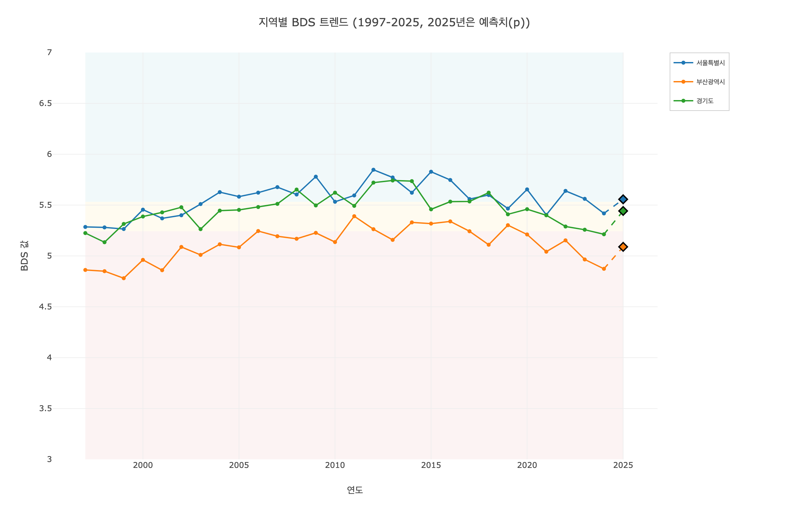
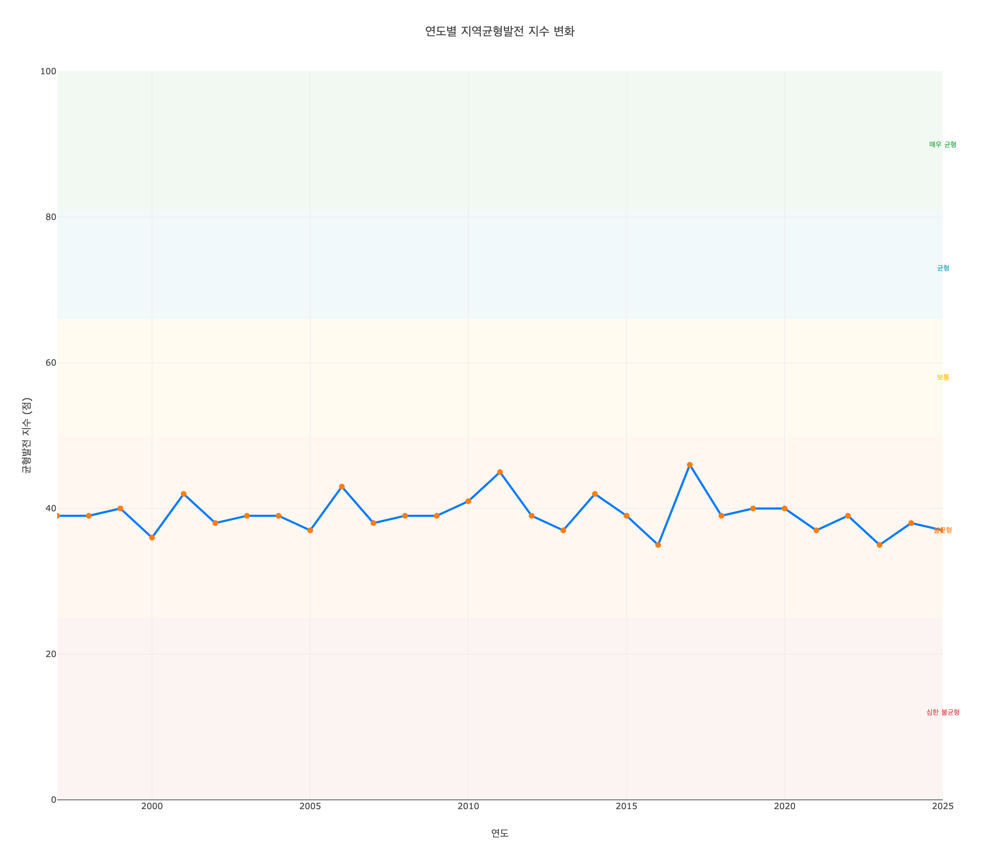
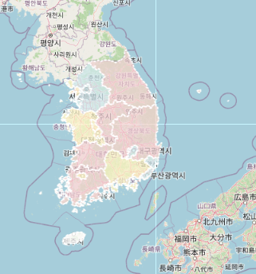
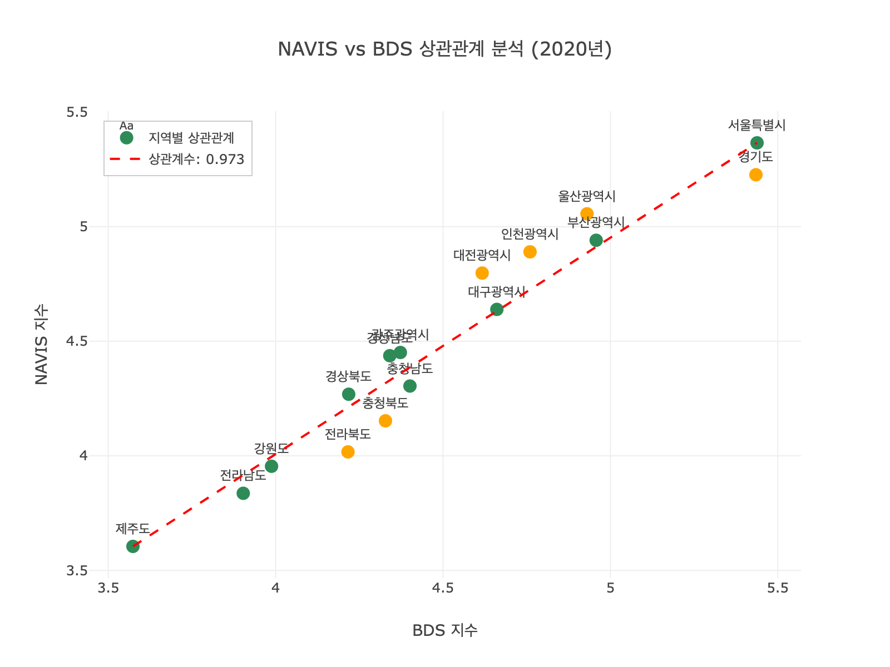

# NAVIS 지역발전지수 종합 분석 대시보드

## ⚠️ 중요: 파일 보호 정책

**`bok_navis_comprehensive_dashboard.html` 파일은 현재 안정화된 상태입니다.**

이 파일은 다음과 같은 중요한 기능들을 포함하고 있습니다:
- 각 행정구역별 BDS 값에 따른 색상 표시
- 마우스 호버/클릭 시 통합된 지표 정보 툴팁 표시
- 연도별 동적 데이터 업데이트
- 학술적 근거 기반 균형발전지수 계산
- 5단계 판정 체계
- 지역별 BDS 트렌드 범례 클릭 기능

이 기능들은 2025년 8월 25일 최신 커밋에서 안정화되었습니다.

## 📋 프로젝트 개요

이 프로젝트는 NAVIS 지역발전지수와 BDS(Business Development Score)를 통합하여 지역 균형발전을 종합적으로 분석하는 웹 대시보드입니다. 한국은행 ECOS API와 KOSIS 데이터를 활용하여 실시간 경제지표를 수집하고, 지역별 균형발전 정도를 시각화하여 정책적 시사점을 도출합니다.

## 🎯 주요 기능

### 1. 지역균형발전지수 (Regional Balanced Development Index)
- **학술적 근거 기반**: Barro & Sala-i-Martin (1992), OECD (2020) 등 기존 연구 기반 가중치 설계
- **실시간 계산**: BDS 값의 지역 간 편차를 분석하여 균형발전 정도를 점수화
- **세부 계산 항목**: 최고-최저 격차, 상위/하위 평균 차이, 표준편차, 중간값 차이
- **5단계 판정 체계**: 매우 균형, 균형, 보통, 불균형, 심한 불균형으로 세분화
- **투명한 공식**: 계산 방법을 명시적으로 표시하여 신뢰성 확보
- **연도별 트렌드**: 1997-2025년 균형발전지수 변화 추이
- **상위 30% 지역명 표시**: 해당 연도의 상위 30% 지역 이름을 직접 표시

### 2. BDS 트렌드 분석
- **다중 지역 선택**: 체크박스를 통한 지역별 BDS 추이 비교 (4열 레이아웃)
- **예측 데이터 구분**: 2025년 예측값을 별도로 표시 (다이아몬드 마커)
- **범례 클릭 기능**: 범례에서 지역을 클릭하면 해당 지역의 모든 데이터(실제+예측) 완전히 숨김
- **Y축 범위 최적화**: 3-7 범위로 설정하여 가독성 향상

### 3. NAVIS vs BDS 상관관계 분석
- **연도별 상관관계**: 1997-2020년 NAVIS와 BDS 간 상관관계 변화
- **점진적 개선**: 상관관계가 시간이 지남에 따라 향상되는 패턴 확인
- **통계적 검증**: Pearson 상관계수를 통한 정량적 분석

### 4. 지역별 BDS 지도 시각화
- **GeoJSON 기반**: 한국 행정구역 경계를 정확히 반영
- **연도별 색상**: BDS 값에 따른 지역별 색상 구분
- **통합 호버/클릭 정보**: BDS, GDP, 인구, 경제활동인구 정보를 호버와 클릭 시 동일하게 표시
- **2025년 예측 표시**: 예측 데이터는 "(예측)" 라벨로 명확히 구분
- **2025년 예측**: 미래 예측값을 지도에 반영

### 5. 정책 시뮬레이션
- **다양한 시나리오**: 인프라, 혁신, 사회, 환경, 균형 투자 시뮬레이션
- **지역별 특성 반영**: 도시/도 지역별 차별화된 투자 효과 분석
- **시각적 결과**: 투자 효과를 직관적으로 표현

## 🛠️ 설치 및 실행

### 1. 환경 설정
```bash
# 가상환경 생성
python -m venv navis_env

# 가상환경 활성화
source navis_env/bin/activate  # macOS/Linux
# 또는
navis_env\Scripts\activate  # Windows

# 의존성 설치
pip install -r requirements.txt
```

### 2. 대시보드 실행
```bash
# 로컬 서버 실행 (CORS 이슈 해결을 위해 필요)
python3 -m http.server 8000

# 브라우저에서 접속
open http://localhost:8000/bok_navis_comprehensive_dashboard.html
```

## 📁 파일 구조

```
NAVIS_contest/
├── bok_navis_comprehensive_dashboard.html        # 메인 종합 대시보드
├── regional_balance_simulation.py                # 지역 균형발전 시뮬레이션
├── comprehensive_bds_data.csv                    # BDS 데이터
├── regional_balance_simulation_data.csv          # 시뮬레이션 결과 데이터
├── regional_balance_simulation_report.md         # 시뮬레이션 보고서
├── navis_data/                                   # NAVIS 원본 데이터
│   ├── 1_2. 시계열자료(사이트게재)_지역발전지수_2021년.xlsx
│   └── skorea-provinces-2018-geo.json           # 한국 지도 Geojson
├── kosis_data/                                   # KOSIS 데이터
├── outputs_timeseries/                           # 시계열 분석 결과
├── requirements.txt                              # Python 의존성
├── .gitignore                                    # Git 제외 파일
├── LICENSE                                       # 라이선스
└── README.md                                     # 프로젝트 문서
```

## 📊 주요 분석 결과

### 지역균형발전지수 계산 공식 (학술적 근거 기반)
```
균형발전 지수 = 격차 점수 × 0.35 + 균형 점수 × 0.30 + 분산 점수 × 0.20 + 중간값 점수 × 0.15

개별 점수 계산:
- 격차 점수: max(0, 100 - 최고-최저 격차 × 50)
- 균형 점수: max(0, 100 - 상위/하위 평균 차이 × 60)
- 분산 점수: max(0, 100 - 표준편차 × 40)
- 중간값 점수: max(0, 100 - 중간값 차이 × 50)

발전 수준 판정 (5단계):
- 81-100점: 매우 균형
- 66-80점: 균형
- 50-65점: 보통
- 25-49점: 불균형
- 0-24점: 심한 불균형
```

### BDS 모델 특징
- **데이터 소스**: ECOS + KOSIS (NAVIS 제외)
- **분석 기간**: 1997-2025년 (29년간)
- **예측 기간**: 2025년 (ECOS+KOSIS 기반 예측)
- **지역 수**: 17개 행정구역

### 시각화 특징
- **반응형 디자인**: Bootstrap 5 기반 모바일 친화적 UI
- **인터랙티브 차트**: Plotly.js 기반 동적 시각화
- **지도 시각화**: Leaflet.js 기반 GeoJSON 지도
- **모달 시스템**: 상세 설명을 위한 Bootstrap 모달

## 🔬 기술적 특징

### 프론트엔드
- **HTML5**: 시맨틱 마크업
- **CSS3**: Bootstrap 5 프레임워크 활용
- **JavaScript**: Vanilla JS로 구현된 인터랙티브 기능
- **차트 라이브러리**: Plotly.js
- **지도 라이브러리**: Leaflet.js

### 데이터 처리
- **시드 기반 랜덤**: 일관된 결과를 위한 시드 설정
- **실시간 계산**: 클라이언트 사이드에서 동적 계산
- **데이터 검증**: 안전한 데이터 처리 및 오류 처리

### 성능 최적화
- **지연 로딩**: 필요한 시점에 데이터 로드
- **메모리 효율성**: 불필요한 데이터 캐싱 방지
- **반응성**: 사용자 인터랙션에 즉시 반응

## 📸 대시보드 스크린샷

### 주요 기능별 시각화

#### 1. 지역균형발전지수 대시보드

- 5단계 판정 체계 (매우 균형, 균형, 보통, 불균형, 심한 불균형)
- 상위 30% 지역명 직접 표시
- 학술적 근거 기반 가중치 적용

#### 2. 지역균형발전지수 트렌드 차트

- 1997-2025년 연도별 균형발전지수 변화 추이
- 5단계 판정 기준에 따른 배경 색상 구분
- 학술적 근거 기반 가중치로 계산된 점수 표시

#### 3. 지역별 BDS 트렌드 차트

- 4열 체크박스 레이아웃
- 2025년 예측치 다이아몬드 마커
- 범례 클릭으로 지역 완전 숨김 기능

#### 4. 지역별 BDS 지도

- 통합 호버/클릭 정보 (BDS, GDP, 인구, 경제활동인구)
- 2025년 예측 데이터 "(예측)" 라벨 표시
- 연도별 동적 색상 변경

#### 5. NAVIS vs BDS 상관관계 분석

- 연도별 상관계수 변화
- 지역별 산점도 분포
- 통계적 검증 결과

> **참고**: 실제 스크린샷은 `screenshots/` 폴더에 저장되어 있습니다.

### 스크린샷 캡처 가이드
각 기능별로 다음과 같이 스크린샷을 캡처하세요:

1. **균형발전지수 대시보드**: 페이지 상단의 균형발전지수 카드와 트렌드 차트
2. **균형발전지수 트렌드 차트**: 연도별 균형발전지수 변화 추이 차트
3. **BDS 트렌드 차트**: 지역별 BDS 트렌드 섹션 전체
4. **BDS 지도**: 지도와 연도 선택기가 포함된 전체 섹션
5. **상관관계 분석**: NAVIS vs BDS 상관관계 차트와 연도 선택기

캡처 후 `screenshots/` 폴더에 저장하면 README에서 자동으로 표시됩니다.

## 📈 사용 방법

### 1. 지역균형발전지수 확인
- 페이지 상단의 균형발전지수 카드에서 현재 점수와 수준 확인
- 연도 선택기를 통해 특정 연도의 균형발전지수 확인
- 트렌드 차트에서 연도별 변화 추이 확인

### 2. BDS 트렌드 분석
- 체크박스를 통해 관심 지역 선택
- 2025년 예측값은 다이아몬드 마커로 구분
- 호버 시 상세 정보 확인

### 3. 상관관계 분석
- NAVIS vs BDS 상관관계 차트에서 연도별 변화 확인
- 연도 선택기를 통해 특정 연도의 상관관계 확인

### 4. 지역별 지도 분석
- 지도에서 지역별 BDS 값 확인
- 연도 선택기를 통해 특정 연도의 지역별 분포 확인
- 호버 시 지역별 상세 정보 확인

## 🤝 기여 방법

1. 이슈 등록: 버그 리포트 또는 기능 요청
2. 포크 및 브랜치 생성
3. 코드 수정 및 테스트
4. 풀 리퀘스트 제출

## 📄 라이선스

이 프로젝트는 MIT 라이선스 하에 배포됩니다.

## 📞 문의

프로젝트에 대한 문의사항이 있으시면 이슈를 등록해 주세요.

---

**개발 환경**: Python 3.10+, HTML5, CSS3, JavaScript  
**주요 라이브러리**: Bootstrap 5, Plotly.js, Leaflet.js  
**데이터 소스**: 한국은행 ECOS API, KOSIS  
**분석 기간**: 1997-2025년 (29년간)  
**분석 지역**: 17개 행정구역  
**최종 버전**: v2.1 (2025년 8월)